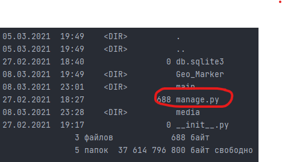
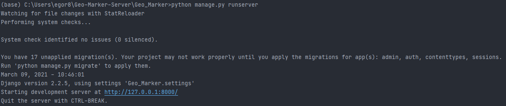

# Geo-Maker

Система работает на базе сервера Django, для отрисовки карты используется Leaflet
Желательно устанавливать на устройства с Windows 10

Библиотеки требуемые для установки: 

`Django` - `pip install django`

`Opencv` - `pip install opencv-python`

`Numpy` - `pip install numpy`

`Geopandas` - см. инструкцию по установке ниже

Дополнительные зависимости для `Geopandas` можно установить из папки lib, но должен быть установлен Anaconda Navigator, в нем открываем Conda Prompt и выполняем следующие команды:

`cd /d lib`

Нужно убедится что у вас Python 3.8 командой

`python --version`

Если версия python отличается файлы можно скачать здесь: https://www.lfd.uci.edu/~gohlke/pythonlibs/
где _cp_ в имени файла ваша версия python, например: cp37 для Python 3.7 

Если проблем нет выполняем следующие команды строго по порядку

`pip install GDAL-3.2.1-cp38-cp38-win_amd64.whl`

`pip install pyproj-3.0.0.post1-cp38-cp38-win_amd64.whl`

`pip install Fiona-1.8.18-cp38-cp38-win_amd64.whl`

`pip install Shapely-1.7.1-cp38-cp38-win_amd64.whl`

`pip install geopandas-0.8.2-py3-none-any.whl`

После установки открываем PyCharm с проектом, в качестве интерпретатора выбираем Python 3.8 (base) со значком конды

Далее открываем Terminal в PyCharm, нужно убедится что мы в папке с проектом для этого пишем `dir` если есть файл `manage.py` значит все верно

Для запуска сервера пишем `python manage.py runserver` так будет выглядеть успешная установка

